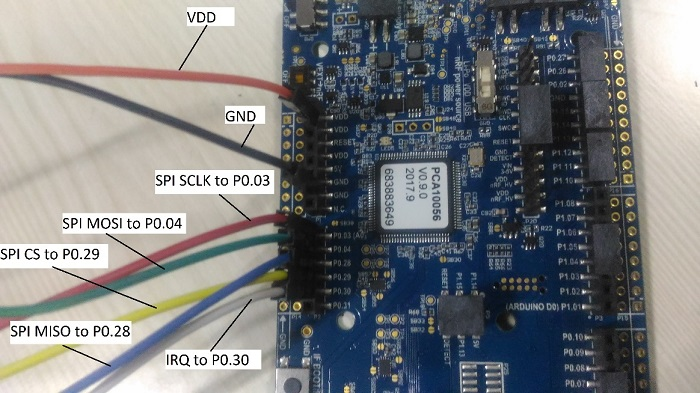
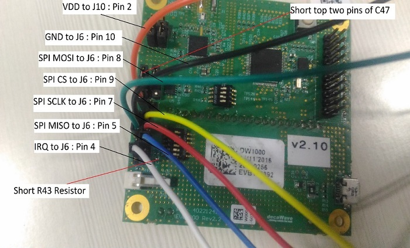
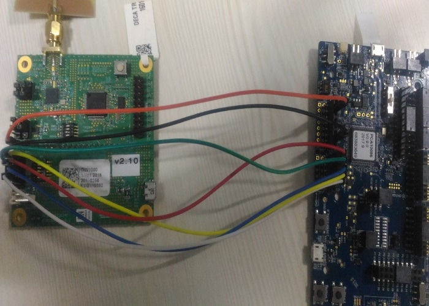

# Hardware Setup
This section explains how to connect the Nordic Hardware Platform to EVB1000 through SPI interface. 
* Turn off S2 DIP switches
* Turn off S3-1 DIP switch
* Remove the jumper J10
Make sure the pins of nRF52840 PDK and EVB1000 Device are blue wired as defined below

## Interfacing EVB1000 with Nordic nRF52840 pdk
 |PIN|EVB1000|NRF52840|
 |-----|-----|-----|
 |IRQ|J6: Pin4|P0.30|
 |MISO|J6: Pin5|P0.28|
 |MOSI|J6: Pin8|P0.4|
 |SCLK|J6: Pin7|P0.3|
 |CS|J6: Pin9|P0.29|
 |GND|J6: Pin10|GND|
 |VDD|J10: Pin2|VDD|

## Connectors for SPI Interface on NRF52840 Nordic Platform to EVB1000

## Connection Details of SPI Interface on NRF52840 Nordic Platform

## Connecting Nordic Hardware to EVM with SPI Interface

