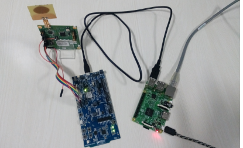

# Thread Bourder Router with Raspberry Pi
## Introduction:
Nordic semiconductors Developed an Example(Thread Border Router), i.e.,  Raspberry Pi as a Border Router connected with NCP node and to the Internet (Ethernet or Wi-Fi).
Thread Border Router serves as a gateway between the Internet and the Thread network. 
This example is tested for nordic radio and also for decawave radio. 

## Required hardware :
* Raspberry Pi 3 B 
* nRF52840 Development Kit 
* 1 GB (or larger) microSD card with SD card adapter 
* microUSB power supply for Raspberry Pi 3 B 
* microUSB to USB cable for connecting the nRF52840 Development Kit to the Raspberry Pi
* Computer running the Linux operating system with SD card slot or SD/microSD USB adapter.


## Required software:
* Terminal client with serial connection support, such as PuTTy/Tera term/ Minicom /Pyterm
* Border Router Raspberry Pi image available from [nRF5 SDK for Thread ](https://www.nordicsemi.com/eng/Products/nRF5-SDK-for-Thread/) in `downloads` section as `RaspPi_Thread_Border_Router_Demo_v0.9.0-1.alpha.img` 
* NCP firmware binary – arm-none-eabi-ot-ncp.hex 
* CLI firmware binary – arm-none-eabi-ot-cli-ftd.hex 

## Setup procedure:
Complete the following steps to set up the Border Router solution:

1.Flashing the Raspberry Pi image to the microSD card
* Download the Raspbian image for thread from the direct link [Rasbian_Image](https://www.nordicsemi.com/eng/nordic/download_resource/60502/12/57596032/118100)
* Extract the package for Image file.
* Insert the SD Card into the SD card adapter and plug the adapter into ubuntu PC.
* Go to the command prompt and check the name given to sd card by using command
```bash	
sudo fdisk -l
```
it may be `/dev/sdb` or `/dev/sdc` or `/dev/sdd`  (varies from PC to PC)
* Use the following command to copy the image on to the Raspberry Pi.
```bash
sudo dd if=<PATH to image>/2017-04-10-raspbian-jessie.img of=/dev/sdc bs=4M
```
ex:
```bash
sudo dd if=~/Downloads/2017-04-10-raspbian-jessie.img of=/dev/sdc bs=4M
sudo sync
```
* Eject the SD card safely.

2. Insert the SD card into Raspberry Pi.
3. Flash the NCP binary on to the Nordic Board connected with EVB1000

## Starting the Border Router:
1. Connect the NCP Node to the Raspberry Pi using micro USB CABLE as shown in the below set up figure.
2. Connect the Raspberry Pi through an Ethernet cable to your switch/router that provides IPv4 or IPv6 connectivity with the DHCP or DHCPv6 service respectively
3. Connect the microUSB power supply to the Raspberry Pi. The Border Router will start booting.

### SetUp Details of NCP Node with Raspberry pi Platform


## Thread Settings:
The following are the default settings of the Border Router: 
```bash
	Radio Channel: 11
	PAN ID: 0xABCD
	Network Master Key: 0x00112233445566778899AABBCCDDEEFF
	Mesh-Local Prefix: FDDE:AD00:BEEF::/64
	NAT64 Prefix: FD00:64:123:4567::/96
```
To customize the Thread settings, you must Log into the Border Router using SSH. 
To Log into Raspberry Pi using SSH, requires it's Ipv4 address.
To find the IP address of Pi , use the `nmap` command on Ubuntu.
   1. Install the `nmap` command using
```bash
sudo apt-get install nmap
```
   2. This method also requires your LAN ipv4 prefix. Use `ifconfig` command to find the prefix.
```bash
Ifconfig
```
ex: if the inet address is 192.168.1.165 then 192.168.1.0 is your network prefix
   
   3. Now use this command , which lists all the IP addresses Present in your Network.
```bash 
sudo nmap -sP 192.168.1.0/24
	     
	Nmap scan report for 192.168.1.249 
	Host is up (-0.100s latency). 
	MAC Address: 00:25:64:B7:0F:01 (Raspberry Pi foundation)
```
   4. From the above output , Note the ipv4 address with the name Raspberry Pi foundation.
      Use the below command with username `root` and `empty password` to Log into Pi.
```bash
ssh root@192.168.1.249
```
Inside the Raspbian , vim/nano editors are available.
To change the settings, edit the `/etc/config/thread_border_router` file. The following lines can be found at the top of the file. 
```bash
vi /etc/config/thread_border_router

# NCP Configuration
ncp_interface="wpan0"
ncp_baudrate="115200"
# Thread Network Configuration
thread_network_key="00112233445566778899AABBCCDDEEFF"
thread_channel="11"
thread_panid="0xABCD"
# IPv6 Addresses Configuration for NAT64
prefix_nat48="fd00:0064:0123::"
prefix_nat64="fd00:0064:0123:4567::"
prefix_ula="fdff:cafe:cafe:cafe::"
# Commissioner Configuration
nfc_commissioner_enable=true
```
**Note:** For the compatiability with Decawave dw1000 radio edit the channel to 5 and panid to 0xdeca.

## Connectivity:
NAT64 technology is enabled by default. It is used to enable communication between the IPv6-only Thread network with pure IPv4 LAN network that the Border Router connects to, as is the case in most applications. In that way, Thread nodes are able to connect to IPv4 cloud services. Thread devices will receive a NAT64-prefix and use it to create their own Unique Local Address.

The other connectivity option, which is also enabled by default, is support for the native IPv6 connection. It uses built-in DHCPv6 client on the Border Router which is able to receive prefixes from the Ethernet interface. If the received prefix is shorter than 63 bits, the 64-bit long subnet prefix is created and forwarded to the Thread network. In such situation, devices create one more address based on the forwarded prefix, which, unlike in a pure NAT64 solution, allows them to be reached from the Internet.

**Note:** When dealing with native IPv6 connectivity, make sure you use the DHCPv6 service, and not the popular Stateless Address Autoconfiguration (SLAAC) tool. This autoconfig tool will only provide a 64-bit long prefix that is not sufficient to delegate a new 64-bit long prefix for the Thread network.
  Support for Domain Name System (DNS) resolution is also available. This mechanism is used to translate a host name into a corresponding IP address. It can be used either for translating a domain name into its native IPv6 or for obtaining its IPv4 address and returning IPv6 translated with the DNS64 mechanism.


## Testing:
1. To test the Border Router, you can use another node with command line interface (CLI) and ping the Google DNS server 8.8.8.8.
2. Flash the CLI Binary onto another Nordic kit connected with EVB1000.
3. Start a terminal emulator like PuTTY/minicom/pyterm/  and connect to the used COM port with the settings described in CLI example

4. Run the following commands: 
```bash
	panid 0xdeca
	channel 5
	ifconfig up
	thread start
	state
	ping fd00:0064:0123:4567::0808:0808
```
**Note:**

0808:0808 is in fact the Google DNS server address "8.8.8.8" in hex representation. In that way, you can reach any IPv4 cloud by replacing last 32 bits of an IPv6 address with a correctly encoded IPv4 address.
After running the command, you should receive the following result: 
```bash
16 bytes from fd00:64:123:4567:0:0:808:808: icmp_seq=5 hlim=39 time=111ms
```

